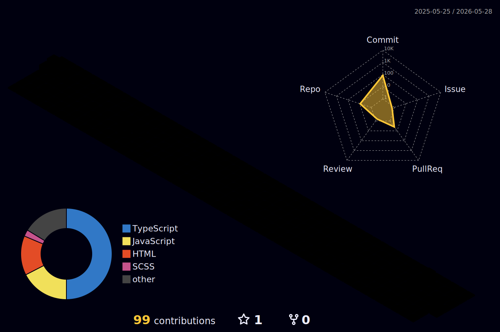

# Olá! Eu sou o Lucas 👋

**Desenvolvedor Full-Stack**

Sou um desenvolvedor apaixonado por criar soluções tecnológicas que resolvem problemas reais. Tenho experiência na construção de aplicações completas (de ponta a ponta) focadas em escalabilidade, usabilidade e integração de sistemas. Atualmente, estou focado em me aprofundar no ecossistema JavaScript/TypeScript e desenvolver projetos de alto impacto.

### 🚀 Sobre mim
- 🎓 Estudante do 3º ano no SENAI (Desenvolvimento de Sistemas / Tecnologia da Informação).
- 💡 Busco sempre explorar novas tecnologias, desde aplicações web corporativas até integrações com Inteligência Artificial.

---

### 💻 Tecnologias e Ferramentas

**Front-end:**  

**Back-end & Banco de Dados:**  

**Infraestrutura & Outros:**  

---

### 📂 Projetos em Destaque

*   **CALLM - Plataforma de Gestão de T.I:** Sistema corporativo Full-Stack (Next.js e Node.js) para rastreabilidade de ativos via QR Code, gestão de chamados técnicos e painel analítico avançado. Vencedor de desafio de inovação.
*   **Sistema de Gestão Farmacêutica:** Aplicação desenvolvida para controle de estoque, gestão de receitas e aplicação de regras de inventário (FEFO), utilizando Next.js e MongoDB.
*   **Assistente Virtual Integrado (IA):** Projeto em Python com reconhecimento de voz e síntese neural, integrado à API do Gemini para atuar como assistente pessoal customizado.

---

### 🏙️ Minhas Contribuições (Night City)

  

---

### 📫 Como me encontrar

